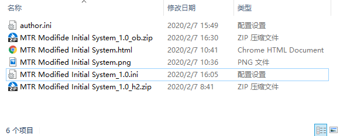

由于内容服务不仅要提供文件，还要提供相关信息、预览图等，所以您需要撰写一些内容与配置文件，并使您的线路档案符合我们所需的格式。

### 准备工作

1. 在您的电脑上您喜爱的位置新建一个空文件夹。
2. 在这个空文件夹之中，新建一个以您目前能够使用的Email为名的文件夹。
   接下来提到的所有操作都将在这个以Email为名的文件夹中进行。

### 关于您的信息

1. 在这个以Email为名的文件夹中新建一个名为  `author.ini ` 的文件，文件名全小写。使用Sublime Text, Notepad++, 或记事本等软件打开。
   在配置过程中您还需要写很多配置文件。我们选择使用配置文件的原因是我们觉得就算改成往某种窗口里面打字也没方便多少……而且其实要写的内容不多。

2. 这是要写进里面的内容的范例：

   ```ini
   Name_LO = "郑爱广"
   Name_EN = "Zheng AiGuang"
   Name_SA = "鄭愛廣"
   Homepage = "https://www.stackoverflow.com"
   Description = "编这么个名字就是为了让简繁字外形差距大点"
   ```

   三个Name从上到下依次是您的"本地名称"，"英文名称"，"辅助名称"。我们建议您在"本地名称"中填写您个人或组织的中文名，"英文名称"中填英文名，"辅助名称"用作简繁互化。如您因使用缩略网名等原因无英文名或无中文名，只需**整行省略**即可，请勿只将引号内留空。辅助名称也可同样整行省略。

   如果您有个人网站，或者您想展示贴吧等各类社区主页之类的东西，请在Homepage一项填写网页链接。如没有同样可整行省略。

   Description一栏是对您的描述文字，同样可省略。若您需要多行文字，直接在中间换行即可，程序使用**英文双引号**来确定文字范围。不过正因如此，您无法在描述文字中使用英文双引号。所以您也可使用——
   **外置描述文件。**如有，索引程序将自动使用`author.html`和`author.txt`文件内容作为对您的描述。在TXT文件中您可自由使用所有符号，您更可以使用HTML来为您的文字加上各种特效。(注: 客户端使用Android之`Html.fromHtml`功能, 支持的标签较少, CSS/JS甭想了, font能用, img倒是可联网加载, 具体请您自行尝试)

   请一定使用**英文引号**放在您文字的两侧。在保存文本时注意采用 `UTF-8` 字符编码，最好`无BOM`。

### 添加路线包

`author.ini` 必须直接放在以Email为名的目录内，但索引程序对您线路的要求就较松了。您可以自由组织目录结构，将线路放在Email为名的目录内，或其任意子目录内。

1. 在您喜爱的位置新建另一个 `ini` 文件。该文件提供一些关于您的路线包的信息。
   不过对于文件名有所要求。请按照以下规则起文件名：

   ```
   [路线全英文名称]_[版本号].ini
   ```

   其中，[全英文名称]中可包括26个大小写字母、数字、空格、及横线 `-`，但不要包括下划线 `_` 。例如：

   ```
   MTR Modified Initial System_1.0.ini
   ```

   很多作者们和中心们会给线路提供多次更新，因此客户端拥有自动更新功能，当线上版本号更新时会自动提示下载新版线路。如果您是转载或并不关心版本号，您可自由发挥，但建议您使用 `1.0` 或 `0.0` 。

2. 这是要写进里面的内容的范例：

   ```ini
   Name_LO     = "港鐵修正早期系統"
   Name_EN     = "MTR Modified Initial System"
   Name_SA     = "港铁修正早期系统 地铁修正早期系统 地鐵修正早期系統"
   Origin_LO   = "香港模擬鐵路發展中心"
   Origin_EN   = "HKRSC"
   Origin_SA   = "香港模拟铁路发展中心"
   Homepage    = "https://hkrailsimcentre.weebly.com/hmmsim2031621697.html"
   Description = "其实把描述放在txt或html中更方便"
   AutoOpen    = False
   ForceView   = False
   ```

   Name即线路名称。Origin为转载作者，原创线路可省略。LO, EN和SA的意义和 `author.ini` 中相同。

   Homepage为线路主页，点开后应展现关于线路的内容。您也可以使用论坛或贴吧贴子的链接，没有可省略。

   Description也与个人信息中用法相同。同样也可使用 txt 或 html。不过考虑到一些线路版本间描述信息无大变化，因此名称既可加也可不加版本号，如 `MTR Modified Initial System_1.0.html` 与 `MTR Modified Initial System.html` 均有效。如同时存在，将优先选择有着对应版本号的描述文件。可省略。

   **路线预览图片。**索引程序接受 png 与 jpg 格式图片，同样是版本号加不加均可。如 `MTR Modified Initial System.png `。或如您使用外部图床图片，您可在 ini 文件中加入一行如 `Thumbnail = "https://openbve-project.net/images/logo.png"` 来手动指定预览图片，同时不要在目录下放置图片既可。图片也可省略，如省略会使用倒也不难看的默认图片。

   描述文件和预览图片要与 ini 文件放置在同一目录下，也就是放在它旁边。 

   AutoOpen若设置为True，则按下"安装"按钮后会自动打开您的线路主页。
   而ForceView则要求您必须点击这一页面上一个按钮，或通过各类方式，触发一次到 `bcs://startDownload` 的链接才可开始下载。您可通过这一方式强制玩家阅读一些内容，或为您增添……比如说广告收入？
   如省略这两行，或设置为False，则按下安装按钮后直接开始下载。

3. 复制过来您所有的zip格式线路档，并将其命名为：

   ```
   [路线全英文名称]_[版本号]_[模拟程序].zip
   ```

   其中，`h2 `代表Hmmsim2，`ob`代表openBVE，`b5`代表BVE5。例如：

   ```
   MTR Modified Initial System_1.0_h2.zip
   ```


### 大功告成

此时您已经准备好相应的资料，可以将您的路线档上传到内容服务平台了。有些复杂，辛苦您了！

您的文件夹可能大致要长这样：




### 接下来呢?

内容服务平台没有被设计成由一个单一的服务器组成的平台，因为单一的服务器不仅储量有限，且价格昂贵，维护如此的服务器也超出了个人拥有的人力物力。因此，我们十分建议各位尽量把路线档上传到各类Pages等在线免费可外链存储、托管服务，以分散载荷。

不过，这类托管服务通常有各类限制。因此，仍然有一个由个人自费运营的公用源服务器来让各位上传超规文件。在公用源服务器上托管线路限制更少，也更为方便。但服务器的带宽和存储空间资源有限，且稳定性较差，因此仍然建议您能够使用免费托管服务就使用免费托管服务。

| 服务名称         | 单文件大小限制 | 单储存库限制   | 总大小限制       |
| ---------------- | -------------- | -------------- | ---------------- |
| TeraCloud*       | 无限制         | 不分成存储库   | 每账号 10GB      |
| **公用源服务器** | 1000MB         | 不分成存储库   | 所有上传共用58GB |
| 码云Pages        | 100MB          | 500MB          | 每账号 5GB       |
| Github Pages     | 50MB           | 一同计入总大小 | 每账号 1GB       |

* TeraCloud网盘并无共享功能, 因此若用于共享用途就需共产您的密码
  因此建议您使用随机密码并不要存储个人文件, 并检查是否有人恶意更改